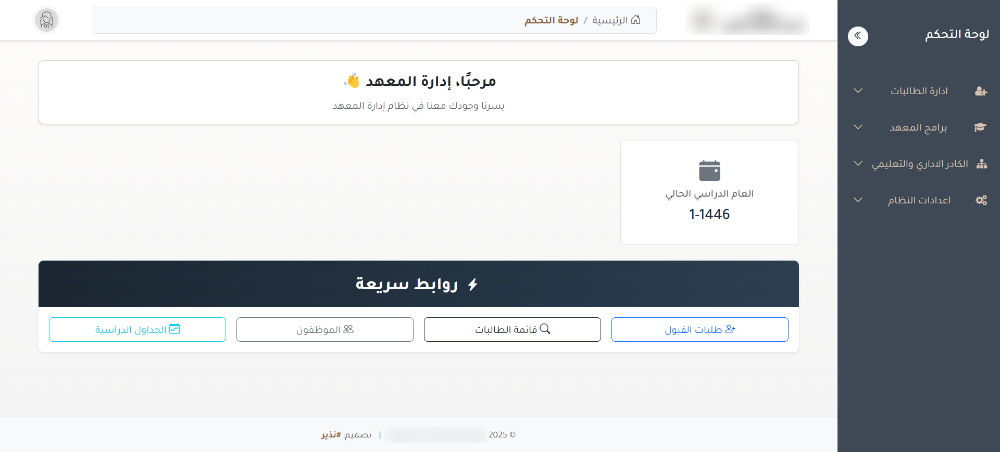
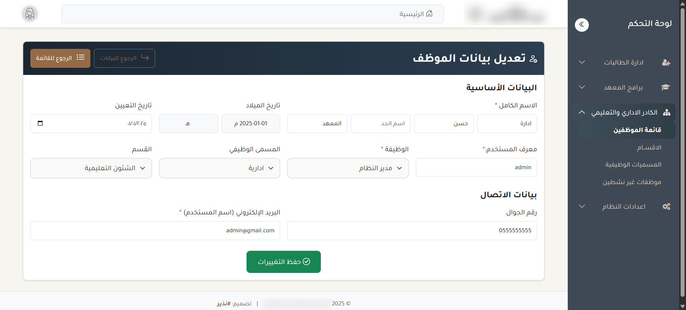

# Admin Dashboard | لوحة تحكم 

🎯 This repository showcases the frontend UI I designed for the admin dashboard section of the educational institution.  
تم تطوير الواجهة الأمامية للوحة التحكم هذه كجزء من مشروع لمنصة تعليمية باللغة العربية.

🔗 [Watch Demo Video | مشاهدة الفيديو التوضيحي](https://youtu.be/e2B6OnCTqdM)

---

## 💡 Overview | نظرة عامة

The dashboard is designed to manage internal modules like user data, programs, and form entries.  
تتيح لوحة التحكم إدارة البيانات الداخلية مثل المستخدمين، البرامج، والنماذج، بواجهة منظمة وسهلة الاستخدام.

---

## 🖼️ Screenshots | صور من الواجهة

### 🏠 Dashboard Home | الصفحة الرئيسية

### 📝 Form Page | صفحة النموذج

---

## 🛠️ Technologies Used | التقنيات المستخدمة

- HTML, CSS, Bootstrap
- JavaScript
- Responsive Design

---

## 📌 Notes | ملاحظات

> This repository includes **only the frontend UI**. Backend code and full project are not published due to privacy and ownership.

> يحتوي هذا المشروع على الواجهة الأمامية فقط. الكود البرمجي والمشروع الكامل غير منشور حفاظًا على الخصوصية.

---

## 📬 Contact | تواصل

Feel free to reach out via GitHub or LinkedIn for any inquiries or collaboration.  
لأي استفسار أو تعاون، تواصل معي عبر GitHub أو LinkedIn.
